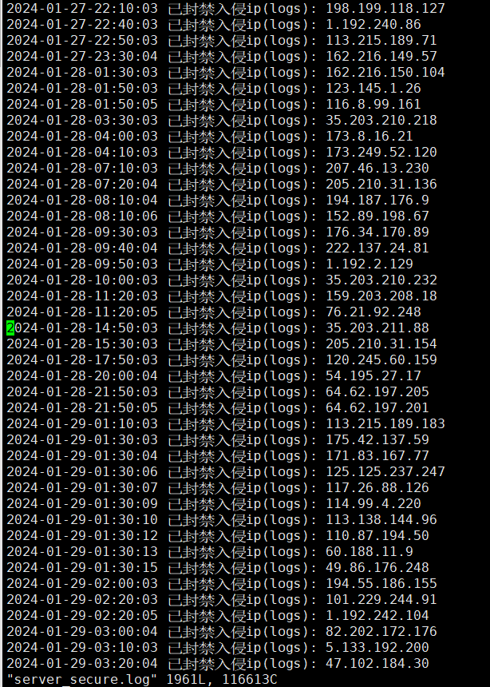

# iFirewalld 

iFirewalld 是一些封禁 ip、解禁 ip 脚本的集合，用它可实现 ip 黑/白名单功能, 其原理是通过调用 Fiwalld 或 Nginx Host Deny File 来实现封禁/解禁 ip 的功能。

## 功能介绍

功能如下：

- 配置文件：可设置配置文件参数供脚本调用
- 封禁 ip：
    - 可从命令行中添加要封禁的 ip,支持批量操作
    - 可解禁指定文件里的 ip，支持批量操作
    - 自动封禁 nginx log、secure log、lastb 次数超过指定数量的 ip
    - 通过日志文件偏移量读取日志文件，避免读取到重复数据
    - 数据校验: 防火墙和黑名单数据一致性校验，nginx host deny file 数据一致性校验
    - 随意切换封锁 ip 的方案（firewalld/nginx）并迁移前方案的数据
- ip 白名单：
    - 将 ip 添加进白名单，支持批量操作
    - 从白名单中删除 ip，支持批量操作
    - 获取白名单列表
- 解禁 ip:
    - 可从命令行中添加要解禁的 ip,支持批量操作
    - 可解禁指定文件里的 ip，支持批量操作

## 目录结构

带有 `.sh` 后缀的都是执行函数，它会调用 `lib/` 下的函数库，执行相关操作。

```bash
│  black_list.sh   # 黑名单/封禁 ip
│  config.sh       # 配置
│  crontab.txt     # crontab 命令
│  unban_the_ip.sh # 解禁 ip
│  white_list.sh   # 白名单
└─lib
    blacklist      # 黑名单功能核心库，由上面的 black_list.sh 调用
    common         # 公共函数库
    firewall       # 防火墙操作函数库
    nginx          # Nginx 操作函数库
```

## 运行

- 为所有 `.sh` 后缀的脚本添加可执行权限: `cd iFirewalld && chmod +x *.sh`
- 通过 `./config.sh -c` 生成配置文件
- 封禁 ip: 提供了三种方式来获取到待封禁的 ip，下面是三种方式的介绍，请选择一种：
    - 通过分析 Nginx 日志(增量分析,)、secure 日志、lastb 登录失败获取待封禁的 ip 列表:
        - 前提：[Nginx 日志切割](#nginx_cut_log)
        - 需执行: `./black_list.sh add`
    - 通过命令行输入单个或多个 ip, 需执行: `./black_list.sh add -i` 然后输入一个或多个 ip, 多个 ip 用空格隔开
    - 通过获取文件里的 ip, 需执行: `./black_list.sh add -f 文件路径` 然后输入一个文件路径
- 自动执行:
    - ```bash
        0 0 * * * /usr/sbin/logrotate -f /etc/logrotate.daily.0/nginx >/dev/null 2>&1
        */10 * * * * sh /root/black_list.sh add > /dev/null 2>&1 &
        0 0 * * * /usr/bin/echo 0 > /tmp/nginxlog_seek && rm -rf /tmp/nginxlog_since* && rm -rf /tmp/securelog_since*
        ```
## 效果图



## FAQ

- 配置文件不知道该怎么写,该怎么办？
    - 通过 `./config.sh -c` 生成配置文件时建议全部回车，使用默认值,如果有需要修改的地方再通过 `vim .server_secure.conf` 进行修改。
    - 配置文件中的 `limit_count` 表示这个 ip 出现的次数,当超过这个值时就会被封禁，在通过日志文件获取待封禁 ip 时会用到
    - 配置文件中的 `block_ip_type` 表示当前用什么方式来封禁 ip,有两种方式：firewalld 和 nginx，默认是使用防火墙来实现封禁 ip 的功能。
- 如何查看配置文件路径？
    - `./config.sh -f` 可查看配置文件路径
- 我的服务器上没有安装 Firewalld，可以实现封禁 ip 吗？
    - 可通过 `./config.sh -m` 来将封禁 ip 的方案改为 Nginx Host Deny File
- 如何解禁 ip ?
    - black_list.sh 以及 unban_the_ip.sh 都提供了解禁 ip 的功能，请选择一种方式：
        - 使用 unban_the_ip.sh 解禁 ip：
            - 执行 `./unban_the_ip.sh -u`: 解封单个或多个 ip 
            - 执行 `./unban_the_ip.sh -f 文件路径`: 可从文件中获取 ip 并解禁
        - 使用 black_list.sh 解禁 ip：
            - 执行 `./black_list.sh remove`: 解封单个或多个 ip 
            - 执行 `./black_list.sh remove -f 文件路径`: 可从文件中获取 ip 并解禁
- 如何查看被封禁的 ip 列表?
    - `./blacklist.sh list` 可显示被封禁的 ip 列表
- 如何查看操作日志？
    - `server_secure.log` 记录了黑名单/白名单添加、黑名单/白名单删除 等操作日志
- 如何添加/删除白名单?
    - 执行 `./white_list.sh add` 可添加白名单
    - 执行 `./white_list.sh remove` 可删除白名单
    - 执行 `./white_list.sh list` 可打印白名单列表
- 如何确保黑名单数据与防火墙/Nginx Deny Host File 中的数据一致？
    - `./black_list.sh test` 可校验数据，如果数据不一致将进行同步
- 目前支持哪几种封禁 ip 的方案?
    - 当前版本仅支持通过 Firewalld 程序以及 Nginx Host Deny File 来封禁/解禁 ip

## 附录: Nginx 日志切割<a id="nginx_cut_log"></a>

- `sudo vim /etc/logrotate.daily.0/nginx`
- 添加如下内容：
    - ```bash
        /usr/share/nginx/logs/*.log {
            daily
            missingok
            rotate 30
            compress
            dateext
            delaycompress
            notifempty
            create 640 root root
            sharedscripts
            postrotate
                    if [ -f /var/run/nginx.pid ]; then
                            kill -USR1 `cat /var/run/nginx.pid`
                    fi
            endscript
        }
        ```

- 添加定时任务,每天 00:00 产生新的日志文件: `0 0 * * * /usr/sbin/logrotate -f /etc/logrotate.daily.0/nginx >/dev/null 2>&1`


